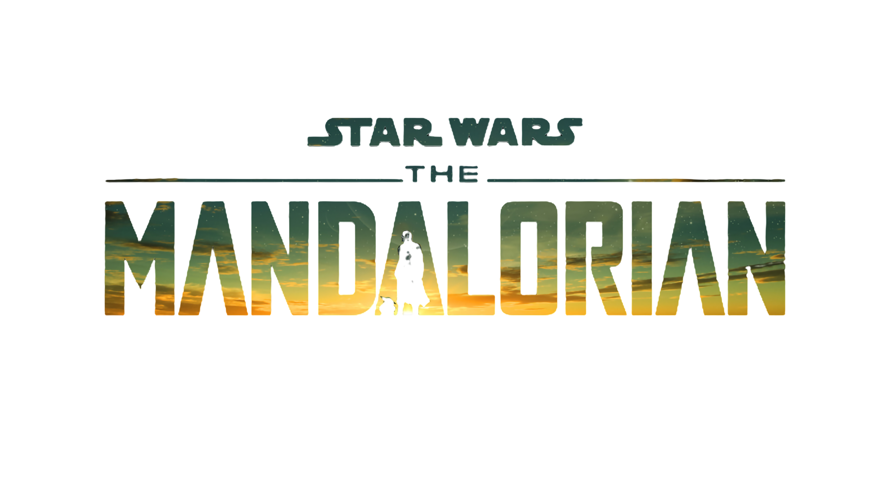

<h1 align="center"> Projeto The Mandalorian </h1>

  

Este é um projeto de page de apresentação da terceira temporada da série da Disney+ The Mandalorian, onde é feito um carrossel de imagens com uma pequena introdução da série .  

  <a href="#-tecnologias">Tecnologias</a>&nbsp;&nbsp;&nbsp;|&nbsp;&nbsp;&nbsp;
  <a href="#-projeto">Projeto</a>&nbsp;&nbsp;&nbsp;|&nbsp;&nbsp;&nbsp;
  <a href="#-layout">Layout</a>&nbsp;&nbsp;&nbsp;|&nbsp;&nbsp;&nbsp;
  <a href="#memo-licença">Licença</a>

  

 
<!-- <h3>🖥️ Desktop</h3> -->

  

  

 
<!-- <h3>📱Mobile</h3>

<!-- 

  

 -->

  

## 🚀 Tecnologias

Esse projeto foi desenvolvido com as seguintes tecnologias:

 
  &nbsp; &nbsp; &nbsp; &nbsp;
  &nbsp; &nbsp; &nbsp; &nbsp;
  &nbsp; &nbsp; &nbsp; &nbsp; 
&nbsp; &nbsp; &nbsp; &nbsp;
  
<!-- &nbsp; &nbsp; &nbsp; &nbsp; -->

 

  

<!-- ## ⚙️ API

AdviceSlip [CLICK AQUI](https://api.adviceslip.com/) 
   -->

## 💻 Projeto

Página de apresentação da série The Mandalorian da Disney+ .

 [Visite o projeto online](https://github.com/JacqueNunes/the-mandalorian)
   

## 🔖 Layout

Você pode visualizar o layout do projeto através [DESSE LINK](jacquenunes.github.io/the-mandalorian/).

## :memo: Licença

Esse projeto está sob a licença MIT. 

---
 

<table>
  <tr>
    <td>
      
    </td>
    <td>
      
    </td>
    <td>
      Feito por <a href="https://github.com/JacqueNunes">Jacqueline Nunes 💜</a>
        Mentoria de <a href="https://devemdobro.com/matriculas-abertas/">Devemdobro</a> 
    </td>
  </tr>
</table>